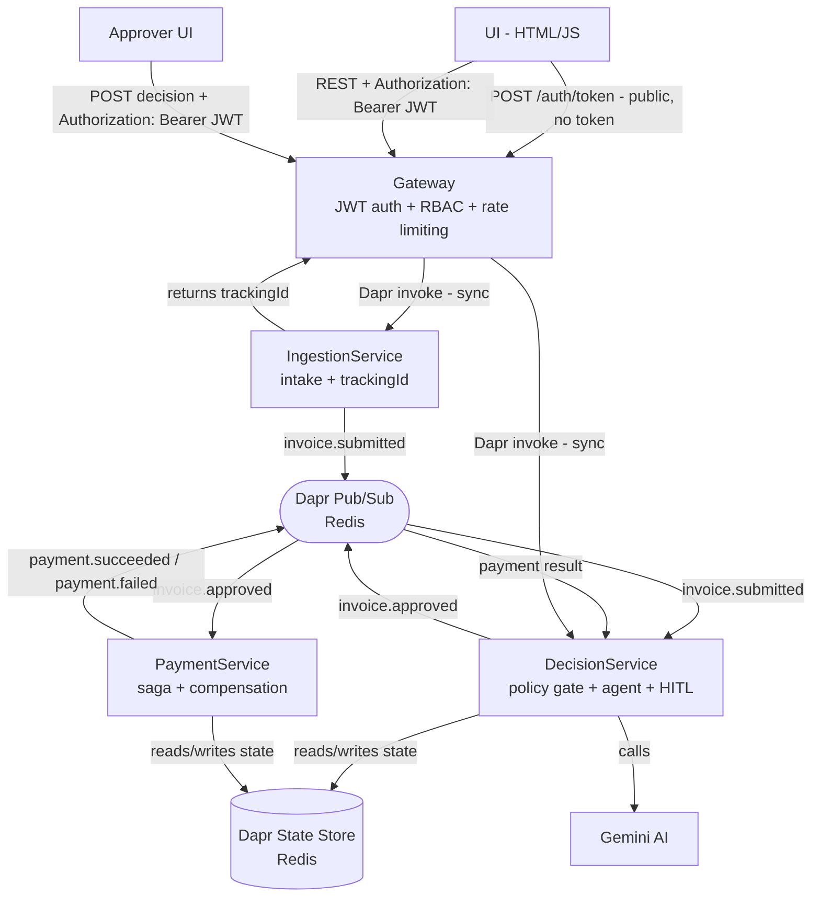
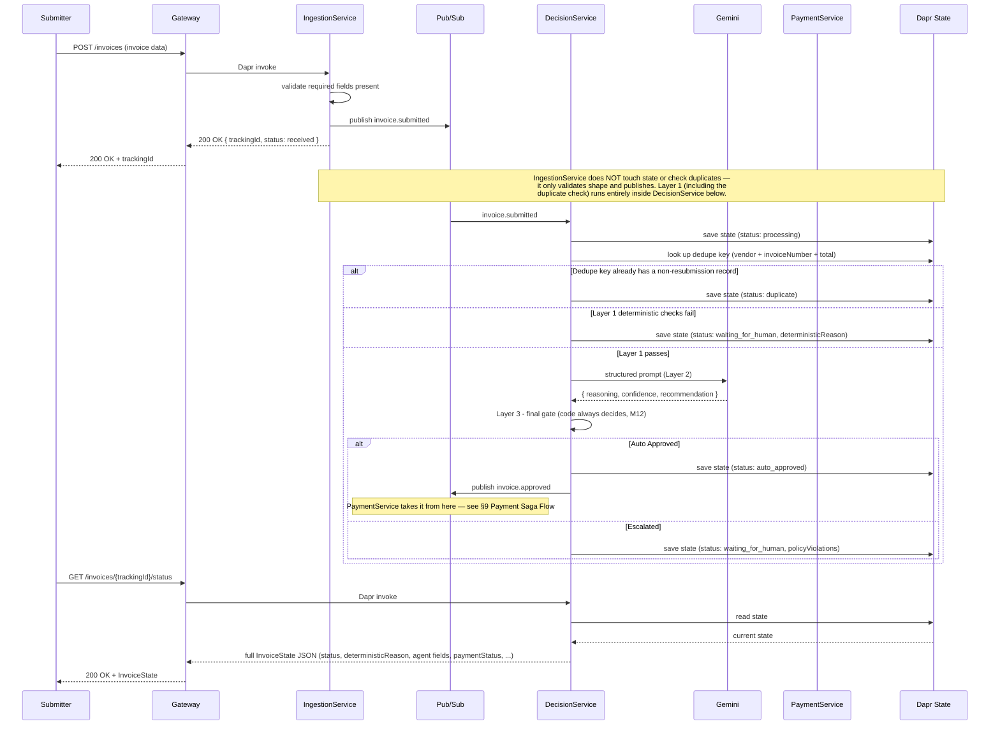
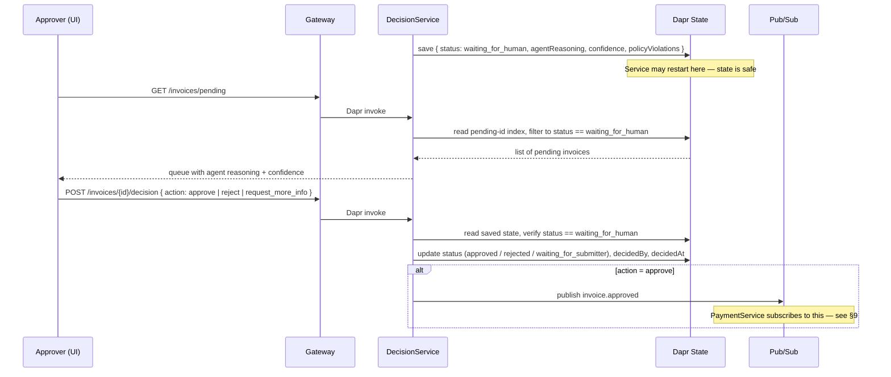
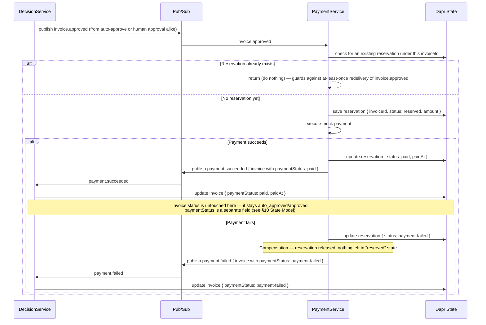
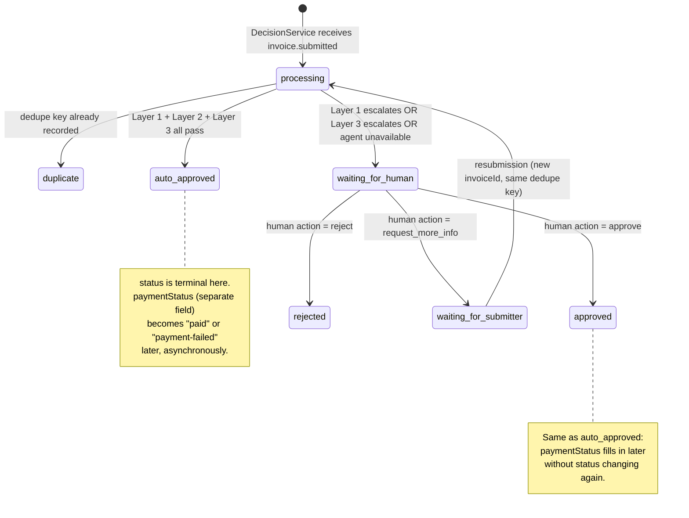
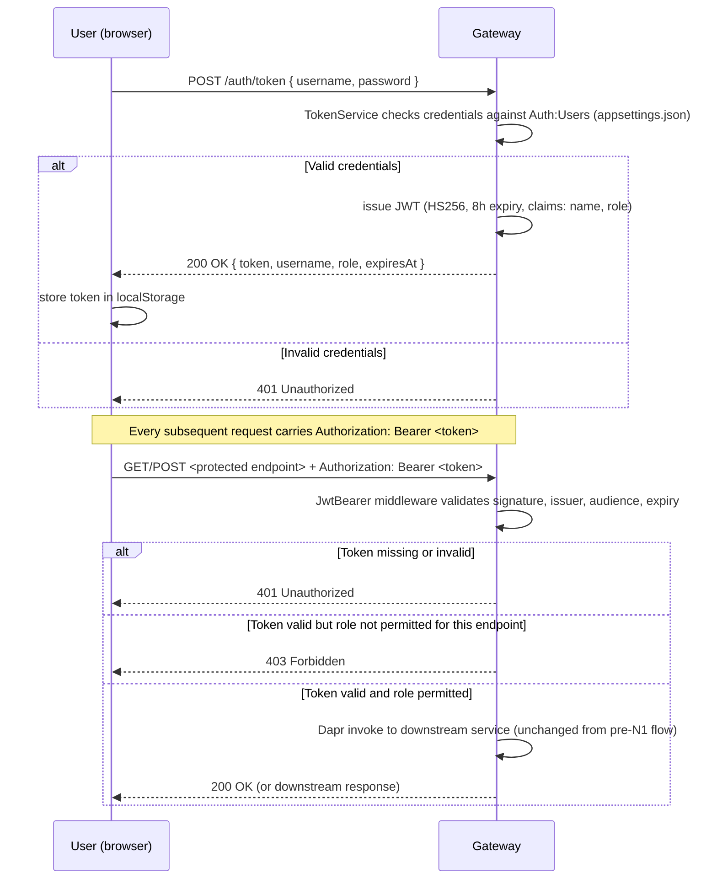

# ARCHITECTURE.md — ApprovalFlow

**Company:** ClearSpend Ltd.
**System:** Invoice & Expense Approval Platform
**Version:** 1.2
**Last Updated:** July 12, 2026 — revised to match the implementation as built (see §7–§11); JWT authentication and role-based authorization added (N1, see §14)

---

## 1. System Overview

ApprovalFlow is a microservice-based, AI-assisted platform that automates invoice and expense approvals for ClearSpend Ltd. The system ingests invoices, uses an AI agent to judge them against company policy, automatically approves the simple low-risk majority, and escalates unclear or high-value cases to a human approver. Every decision is fully auditable via a correlation id.

---

## 2. Architecture Principles

- **Async by default** — submitters never wait for processing
- **Deterministic code gates AI** — the agent only recommends, code always decides
- **Fail fast, never silently** — errors are always logged and surfaced
- **State is external** — all state lives in Dapr State Store, never in memory
- **Single responsibility** — each service does exactly one thing
- **Configurable without redeploy** — policy thresholds live in Dapr config

---

## 3. Services

### 3.1 Gateway
- Single external entry point for all client requests
- Issues JWTs via `POST /auth/token` and validates them on every other request; enforces per-endpoint, role-based authorization (N1 — see §14)
- Rate limiting (max 100 requests/minute, partitioned by client IP)
- Routes requests to the correct service via Dapr service invocation
- No business logic

### 3.2 IngestionService
- Receives invoice submissions from the UI
- Validates basic structure (required fields present)
- Generates and returns a unique `trackingId` immediately
- Publishes invoice to Dapr pub/sub topic `invoice.submitted`
- Intentionally small (~50 lines) — intake only

### 3.3 DecisionService
- Subscribes to `invoice.submitted` topic
- Runs **Layer 1** — deterministic policy gate
- Runs **Layer 2** — AI agent (Gemini) if invoice passes Layer 1
- Runs **Layer 3** — deterministic final gate (proves M12)
- Manages Human-in-the-Loop (HITL) — saves state, pauses, resumes
- Saves all decision data to Dapr State Store
- Publishes `invoice.approved` to PaymentService if approved

### 3.4 PaymentService
- Subscribes to `invoice.approved` topic
- Reserves budget in Dapr State Store
- Executes payment (mocked)
- Releases reservation on failure (compensation)
- Publishes `payment.succeeded` or `payment.failed`
- Guarantees no double payments (idempotency check)

---

## 4. Technology Stack

| Component | Technology |
|---|---|
| Language | C# / .NET 9 |
| Communication | Dapr (service invocation + pub/sub) |
| State Store | Dapr State Store (Redis) |
| Message Broker | Dapr pub/sub (Redis) |
| Secrets | Dapr Secrets |
| Config | Dapr Configuration Store |
| AI Agent | Gemini (via ILlmProvider interface) |
| Containerization | Docker + Docker Compose |
| CI | GitHub Actions |
| UI | HTML + JavaScript |

---

## 5. Decision Logic

### Layer 1 — Deterministic Code (Policy Gate)

Checks in order:

| # | Check | Condition | Result |
|---|---|---|---|
| 1 | Duplicate | vendor + invoiceNumber + total already processed | `duplicate` |
| 2 | Math | lineItems + tax ≠ total | `escalate` |
| 3 | Receipt | receiptPresent = false | `escalate` |
| 4 | Vendor | vendorKnown = false | `escalate` |
| 5 | Amount | total > $500 | `escalate` |
| 6 | Category | not in white list | `escalate` |
| 7 | Passed all | — | `pass_to_agent` |

### White List Categories

- Office supplies
- Business meals
- Transportation (bus, train, taxi — no flights)
- Software / SaaS
- Hardware (up to $500)

### Layer 2 — AI Agent (Gemini)

Receives only what is relevant to its judgment:
- vendor, category, total, description, lineItems

Returns structured output (reasoning first):
```json
{
  "reasoning": "...",
  "amount_reasonable": true,
  "items_consistent_with_category": true,
  "confidence": 0.95,
  "recommendation": "auto_approve"
}
```

### Layer 3 — Deterministic Final Gate

| Condition | Final Result |
|---|---|
| confidence < 0.80 | `escalate` |
| amount_reasonable = false | `escalate` |
| items_consistent_with_category = false | `escalate` |
| recommendation = auto_approve + all checks passed | `auto_approve` |

> The agent only recommends — the code always decides. This proves M12.

### Autonomy Thresholds (externally configurable via Dapr config)

| Key | Value | Meaning |
|---|---|---|
| `autonomy-ceiling` | $500 | Auto-approve only when total ≤ $500 |
| `autonomy-confidence` | 0.80 | Auto-approve only when confidence ≥ 0.80 |

---

## 6. System Diagram



---

## 7. Invoice Submission Flow (Sequence Diagram)



---

## 8. Human-in-the-Loop Flow



---

## 9. Payment Saga Flow (with Compensation)



---

## 10. State Model

Every invoice is stored in Dapr State Store under two keys with identical content: `invoiceId` (a generated GUID — the primary record) and a secondary dedupe-key index `vendor_invoiceNumber_total` (used by the duplicate check, since Redis has no secondary indexes of its own). **`invoiceId` is not the same thing as `invoiceNumber`** — the former is a system-generated tracking id, the latter is the human-entered invoice number from the submission (e.g. `"INV-1003"`), which is what the duplicate check actually keys on.

Example — an escalated invoice (missing receipt) that a human then approved, and payment succeeded:

```json
{
  "invoiceId": "3fa85f64-5717-4562-b3fc-2c963f66afa6",
  "correlationId": "3fa85f64-5717-4562-b3fc-2c963f66afa6",
  "submitter": "amit.levi@clearspend.example",
  "vendor": "Bistro 19",
  "invoiceNumber": "INV-1003",
  "category": "business_meals",
  "total": 42.00,
  "submittedAt": "2026-07-12T10:00:00Z",
  "dedupeKey": "bistro 19_inv-1003_42.00",

  "deterministicResult": "escalate",
  "deterministicReason": "GLOBAL-RECEIPT",

  "agentRecommendation": null,
  "agentReasoning": null,
  "agentConfidence": null,
  "agentAmountReasonable": null,
  "agentItemsConsistentWithCategory": null,
  "policyViolations": [],
  "escalatedAt": "2026-07-12T10:00:00Z",

  "status": "approved",
  "finalDecision": null,
  "decidedAt": "2026-07-12T10:05:00Z",

  "decidedBy": "approver-1",
  "humanAction": "approve",
  "comment": null,

  "paymentStatus": "paid",
  "paidAt": "2026-07-12T10:05:03Z"
}
```

Note that `agentRecommendation`/`agentReasoning`/etc. stay `null` here — this invoice never reached Layer 2 because it was escalated by Layer 1 (`GLOBAL-RECEIPT`) before the agent was ever called. A clean auto-approve populates the agent fields and `finalDecision` instead, and never touches `decidedBy`/`humanAction`/`comment`.

---

## 11. Invoice Lifecycle — Status vs. PaymentStatus

`status` and `paymentStatus` are two **separate, independently-updated fields**, not one combined lifecycle — a common misreading of this model. `status` reaches a terminal value (`auto_approved`, `approved`, `rejected`, `duplicate`) and is never overwritten afterwards; `paymentStatus` starts `null` and is filled in later, asynchronously, by `PaymentResultProcessor` reacting to `payment.succeeded`/`payment.failed`. An `auto_approved` invoice whose payment later fails still has `status: auto_approved` — it does **not** transition to some `payment_failed` status value.



---

## 12. Key Design Decisions

| Decision | Choice | Reason |
|---|---|---|
| Services count | 4 | Clear separation of concerns without over-engineering |
| Agent framework | Direct Gemini API via ILlmProvider | Simple, swappable, no framework overhead |
| HITL mechanism | Dapr State Store | Already required, survives restarts, no extra infrastructure |
| Saga style | Choreography | 2-3 steps only, fits Dapr pub/sub naturally |
| Duplicate detection | vendor + invoiceNumber + total | Prevents gaming via id change |
| State storage | Dapr State Store (Redis) | Required by M5, sufficient for project scope |
| LLM for CI | Stub/Mock | Deterministic, free, no rate limits |

---

## 13. Trade-offs

| Trade-off | Decision | Justification |
|---|---|---|
| Only Dapr State, no dedicated DB | Accepted | Sufficient for project scope; would add PostgreSQL in production |
| No NotificationService | Accepted | DecisionService handles notifications — simpler for deadline |
| Mock payment provider | Accepted | Project requirement — no real payment service needed |
| Choreography over Orchestration | Accepted | 2-3 steps only — orchestration adds unnecessary complexity |
| Minimal UI | Accepted | Project requires "minimal UI" — not a full application |

---

## 14. Authentication & Authorization (N1)

Gateway is the only service that knows about JWTs — IngestionService, DecisionService, and PaymentService are unauthenticated internally and trust Gateway to have already checked the caller.

### 14.1 Login Flow



`POST /auth/token` and `GET /health` are the only public endpoints. Every other endpoint is protected by a secure-by-default fallback authorization policy — a new endpoint added without an explicit role requirement is rejected with 401, not silently left open.

### 14.2 Roles & Permissions

| Endpoint | submitter | approver | admin |
|---|---|---|---|
| `POST /auth/token` | public | public | public |
| `GET /health` | public | public | public |
| `POST /invoices` | ✅ | — | ✅ |
| `GET /invoices/{id}/status` | ✅ | ✅ | ✅ |
| `GET /invoices/pending` | — | ✅ | ✅ |
| `POST /invoices/{id}/decision` | — | ✅ | ✅ |
| `GET /dashboard/stats` | — | ✅ | ✅ |

### 14.3 Predefined Users

Three hardcoded demo accounts, configured in `gateway/src/Gateway/appsettings.json` under `Auth:Users` — never in code:

| Username | Password | Role |
|---|---|---|
| `dana` | `pass123` | submitter |
| `manager1` | `pass456` | approver |
| `admin` | `pass789` | admin |

Passwords are stored in plaintext, which is acceptable for this demo/coursework scope but would need hashing before any production use.

### 14.4 Signing Key

The HS256 signing key comes from `JWT_SECRET` in `.env` → `Jwt__Secret` container env var (same pattern as `GEMINI_API_KEY`) → never hardcoded, never committed. `JwtSecretValidator` checks it at Gateway startup and fails fast with a clear error if it's missing or shorter than 32 bytes, rather than crashing cryptically on the first login attempt.
