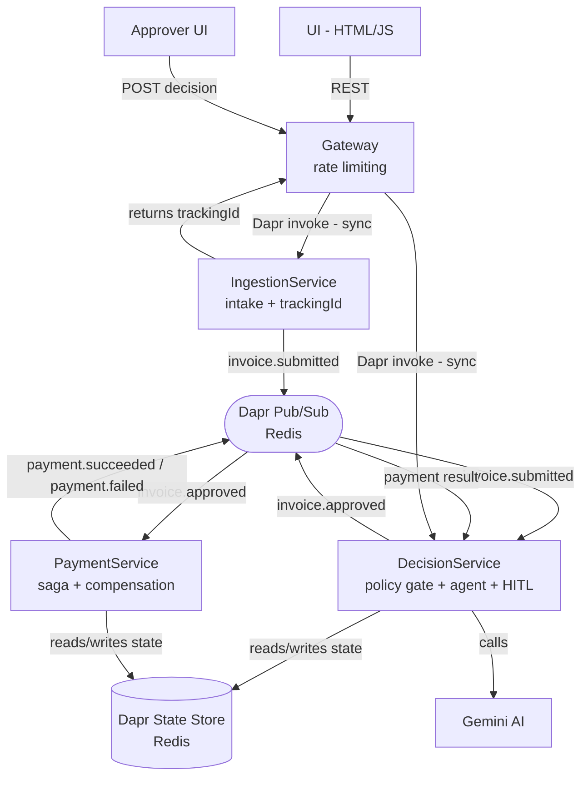
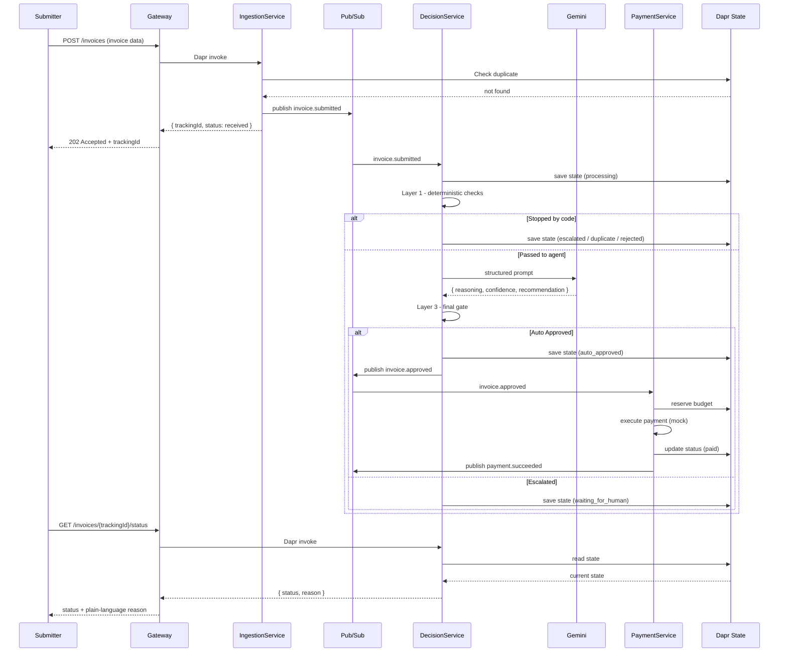
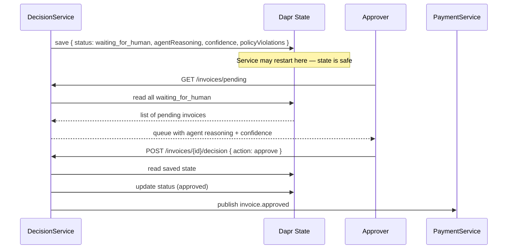
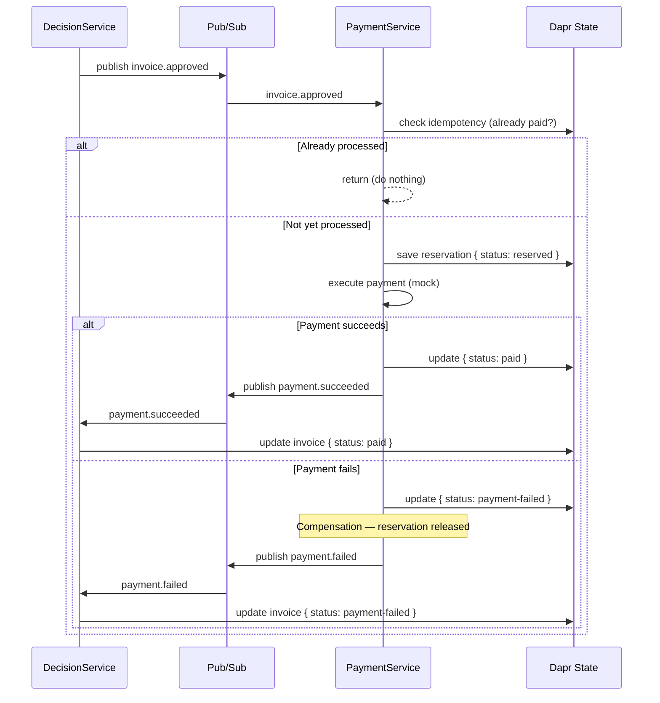
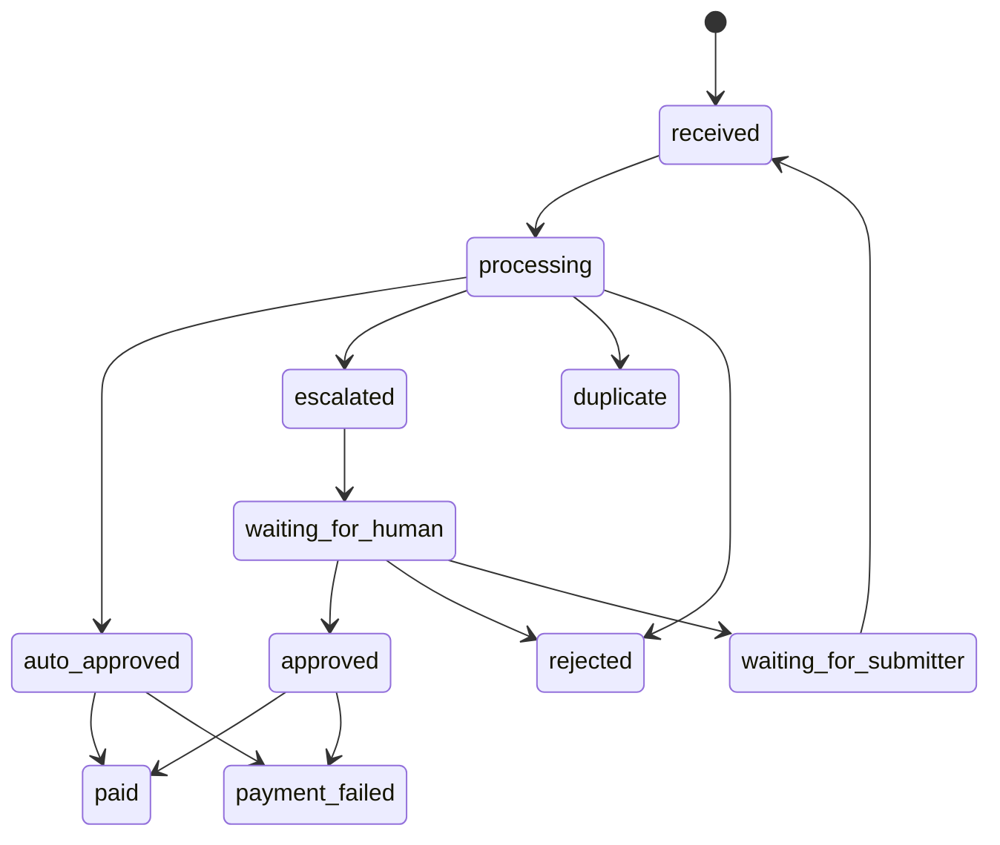

# ARCHITECTURE.md — ApprovalFlow

**Company:** ClearSpend Ltd.
**System:** Invoice & Expense Approval Platform
**Version:** 1.0
**Last Updated:** July 2026

---

## 1. System Overview

ApprovalFlow is a microservice-based, AI-assisted platform that automates invoice and expense approvals for ClearSpend Ltd. The system ingests invoices, uses an AI agent to judge them against company policy, automatically approves the simple low-risk majority, and escalates unclear or high-value cases to a human approver. Every decision is fully auditable via a correlation id.

---

## 2. Architecture Principles

- **Async by default** — submitters never wait for processing
- **Deterministic code gates AI** — the agent only recommends, code always decides
- **Fail fast, never silently** — errors are always logged and surfaced
- **State is external** — all state lives in Dapr State Store, never in memory
- **Single responsibility** — each service does exactly one thing
- **Configurable without redeploy** — policy thresholds live in Dapr config

---

## 3. Services

### 3.1 Gateway
- Single external entry point for all client requests
- Rate limiting (max 100 requests/minute per user)
- Routes requests to the correct service via Dapr service invocation
- No business logic

### 3.2 IngestionService
- Receives invoice submissions from the UI
- Validates basic structure (required fields present)
- Generates and returns a unique `trackingId` immediately
- Publishes invoice to Dapr pub/sub topic `invoice.submitted`
- Intentionally small (~50 lines) — intake only

### 3.3 DecisionService
- Subscribes to `invoice.submitted` topic
- Runs **Layer 1** — deterministic policy gate
- Runs **Layer 2** — AI agent (Gemini) if invoice passes Layer 1
- Runs **Layer 3** — deterministic final gate (proves M12)
- Manages Human-in-the-Loop (HITL) — saves state, pauses, resumes
- Saves all decision data to Dapr State Store
- Publishes `invoice.approved` to PaymentService if approved

### 3.4 PaymentService
- Subscribes to `invoice.approved` topic
- Reserves budget in Dapr State Store
- Executes payment (mocked)
- Releases reservation on failure (compensation)
- Publishes `payment.succeeded` or `payment.failed`
- Guarantees no double payments (idempotency check)

---

## 4. Technology Stack

| Component | Technology |
|---|---|
| Language | C# / .NET 8 |
| Communication | Dapr (service invocation + pub/sub) |
| State Store | Dapr State Store (Redis) |
| Message Broker | Dapr pub/sub (Redis) |
| Secrets | Dapr Secrets |
| Config | Dapr Configuration Store |
| AI Agent | Gemini (via ILlmProvider interface) |
| Containerization | Docker + Docker Compose |
| CI | GitHub Actions |
| UI | HTML + JavaScript |

---

## 5. Decision Logic

### Layer 1 — Deterministic Code (Policy Gate)

Checks in order:

| # | Check | Condition | Result |
|---|---|---|---|
| 1 | Duplicate | vendor + invoiceNumber + total already processed | `duplicate` |
| 2 | Math | lineItems + tax ≠ total | `escalate` |
| 3 | Receipt | receiptPresent = false | `escalate` |
| 4 | Vendor | vendorKnown = false | `escalate` |
| 5 | Amount | total > $500 | `escalate` |
| 6 | Category | not in white list | `escalate` |
| 7 | Passed all | — | `pass_to_agent` |

### White List Categories

- Office supplies
- Business meals
- Transportation (bus, train, taxi — no flights)
- Software / SaaS
- Hardware (up to $500)

### Layer 2 — AI Agent (Gemini)

Receives only what is relevant to its judgment:
- vendor, category, total, description, lineItems

Returns structured output (reasoning first):
```json
{
  "reasoning": "...",
  "amount_reasonable": true,
  "items_consistent_with_category": true,
  "confidence": 0.95,
  "recommendation": "auto_approve"
}
```

### Layer 3 — Deterministic Final Gate

| Condition | Final Result |
|---|---|
| confidence < 0.80 | `escalate` |
| amount_reasonable = false | `escalate` |
| items_consistent_with_category = false | `escalate` |
| recommendation = auto_approve + all checks passed | `auto_approve` |

> The agent only recommends — the code always decides. This proves M12.

### Autonomy Thresholds (externally configurable via Dapr config)

| Key | Value | Meaning |
|---|---|---|
| `autonomy-ceiling` | $500 | Auto-approve only when total ≤ $500 |
| `autonomy-confidence` | 0.80 | Auto-approve only when confidence ≥ 0.80 |

---

## 6. System Diagram



---

## 7. Invoice Submission Flow (Sequence Diagram)



---

## 8. Human-in-the-Loop Flow



---

## 9. Payment Saga Flow (with Compensation)



---

## 10. State Model

Every invoice is stored in Dapr State Store under its `invoiceId`:

```json
{
  "invoiceId": "INV-1001",
  "correlationId": "INV-1001",
  "submitter": "dana.cohen@clearspend.example",
  "vendor": "Bistro 19",
  "category": "meals",
  "total": 42.00,
  "submittedAt": "2026-05-12T10:00:00Z",

  "deterministicResult": "pass_to_agent",
  "deterministicReason": "passed all checks",

  "agentRecommendation": "auto_approve",
  "agentReasoning": "Amount of $42 for a working lunch is reasonable.",
  "agentConfidence": 0.95,
  "policyViolations": [],

  "finalDecision": "auto_approve",
  "decidedAt": "2026-05-12T10:00:05Z",

  "paymentStatus": "paid",
  "paidAt": "2026-05-12T10:00:10Z"
}
```

---

## 11. HITL State Transitions



---

## 12. Key Design Decisions

| Decision | Choice | Reason |
|---|---|---|
| Services count | 4 | Clear separation of concerns without over-engineering |
| Agent framework | Direct Gemini API via ILlmProvider | Simple, swappable, no framework overhead |
| HITL mechanism | Dapr State Store | Already required, survives restarts, no extra infrastructure |
| Saga style | Choreography | 2-3 steps only, fits Dapr pub/sub naturally |
| Duplicate detection | vendor + invoiceNumber + total | Prevents gaming via id change |
| State storage | Dapr State Store (Redis) | Required by M5, sufficient for project scope |
| LLM for CI | Stub/Mock | Deterministic, free, no rate limits |

---

## 13. Trade-offs

| Trade-off | Decision | Justification |
|---|---|---|
| Only Dapr State, no dedicated DB | Accepted | Sufficient for project scope; would add PostgreSQL in production |
| No NotificationService | Accepted | DecisionService handles notifications — simpler for deadline |
| Mock payment provider | Accepted | Project requirement — no real payment service needed |
| Choreography over Orchestration | Accepted | 2-3 steps only — orchestration adds unnecessary complexity |
| Minimal UI | Accepted | Project requires "minimal UI" — not a full application |
