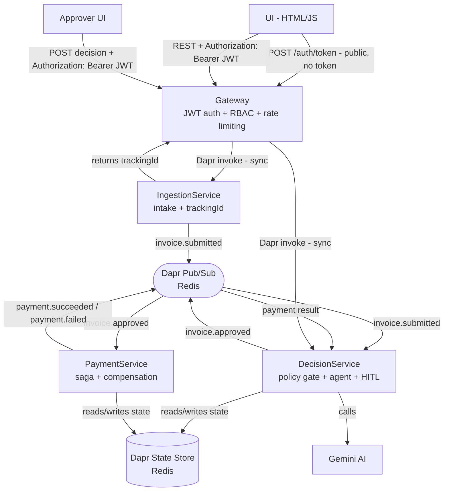

# ApprovalFlow

[](https://github.com/Devora9249/ApprovalFlow/actions/workflows/ci.yml)

ApprovalFlow is a microservice-based, AI-assisted invoice and expense approval platform built for ClearSpend Ltd. Employees submit invoices through a minimal web UI; the system runs them through a deterministic policy gate, then an AI agent (Gemini) judges the business logic, and a final deterministic gate decides whether to auto-approve or escalate to a human approver. Approved invoices flow into a payment saga with compensation on failure, and every decision — automated or human — is fully auditable end-to-end via a correlation id.

---

## Tech Stack

| Component | Technology |
|---|---|
| Language | C# / .NET 9 |
| Framework | ASP.NET Core 9 |
| Communication | Dapr (pub/sub + service invocation) |
| State Store | Dapr State Store (Redis) |
| Pub/Sub broker | Dapr pub/sub (Redis) |
| AI Agent | Gemini (via `ILlmProvider` — swappable) |
| UI | HTML + JavaScript (minimal) |
| Testing | xUnit |
| Logging | Serilog (structured, correlation id on every line) |
| OpenAPI | Swashbuckle (auto-generated) |
| CI | GitHub Actions |
| Containers | Docker + Docker Compose |

---

## System Diagram



See [ARCHITECTURE.md](ARCHITECTURE.md) for the full set of diagrams (sequence flow, HITL flow, payment saga with compensation, state model, HITL state transitions).

---

## How to Run Locally

```bash
cp .env.example .env
# fill in GEMINI_API_KEY and JWT_SECRET in .env (JWT_SECRET must be at least 32 characters —
# Gateway refuses to start otherwise)

docker compose up --build
```

This starts `redis`, `gateway` (+ Dapr sidecar), `ingestion-service` (+ sidecar), `decision-service` (+ sidecar), and `payment-service` (+ sidecar). Once up, the UI is served from the [frontend/](frontend/) HTML files, and the Gateway listens on `http://localhost:5000`.

Health checks:
```bash
curl http://localhost:5000/health   # gateway
curl http://localhost:5001/health   # ingestion-service
curl http://localhost:5002/health   # decision-service
curl http://localhost:5003/health   # payment-service
```

For port mappings, running individual services outside Docker, debugging DecisionService in VS Code with a Dapr sidecar, log locations, and Redis inspection commands, see [DEVELOPMENT.md](DEVELOPMENT.md).

---

## Login

Every page except the login screen itself requires a JWT. Open [frontend/login.html](frontend/login.html) first — it exchanges a username/password for a token via `POST /auth/token`, stores it in the browser's `localStorage`, and sends it as `Authorization: Bearer <token>` on every request after that. Tokens expire after 8 hours; logging out (or a `401` response) clears the stored token and returns you to the login screen.

Three predefined accounts (see [ARCHITECTURE.md §14](ARCHITECTURE.md#14-authentication--authorization-n1) for the full role/endpoint matrix):

| Username | Password | Role | Can access |
|---|---|---|---|
| `dana` | `pass123` | submitter | Submit invoices, check status |
| `manager1` | `pass456` | approver | Check status, approval queue, decisions, dashboard |
| `admin` | `pass789` | admin | Everything |

---

## How to Test

Unit tests (policy gate, final decision gate, HITL processor, payment saga — all using `StubLlmProvider`/fakes, no real Gemini calls):
```bash
dotnet test tests/ApprovalFlow.Tests/ApprovalFlow.Tests.csproj
```

End-to-end verification of all 4 required journeys plus anti-cheese guards, against a running stack:
```powershell
docker compose up --build
./verify.ps1
```

`verify.ps1` submits real invoices from [fixtures/sample-invoices.json](fixtures/sample-invoices.json) through the Gateway and checks: auto-approve with no human, escalate + human approval, duplicate detection, and payment failure + compensation — printing PASS/FAIL per journey and a final `ALL JOURNEYS PASSED` / `SOME JOURNEYS FAILED` line.

CI (`.github/workflows/ci.yml`) builds all 4 services and runs the unit test suite on every push/PR to `main`, using `StubLlmProvider` — it never calls the real Gemini API.

---

## Further Reading

- [ARCHITECTURE.md](ARCHITECTURE.md) — system design, decision logic (Layers 1–3), all sequence/state diagrams, trade-offs
- [DEVELOPMENT.md](DEVELOPMENT.md) — local dev environment, ports, debugging, logs, Redis inspection
- [CLAUDE.md](CLAUDE.md) — build rules and specification this project was implemented against
- Architecture Decision Records — [docs/ADR-001-four-services.md](docs/ADR-001-four-services.md), [docs/ADR-002-choreography.md](docs/ADR-002-choreography.md), [docs/ADR-003-dapr-state-hitl.md](docs/ADR-003-dapr-state-hitl.md), [docs/ADR-004-autonomy-ceiling.md](docs/ADR-004-autonomy-ceiling.md), [docs/ADR-005-no-postgresql.md](docs/ADR-005-no-postgresql.md), [docs/ADR-006-dual-key-storage.md](docs/ADR-006-dual-key-storage.md)
